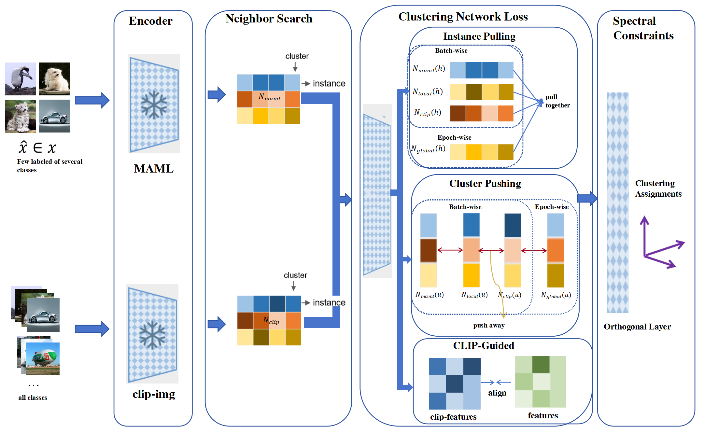

# Few-Shot Meta Spectral Clustering with Knowledge Reuse (FMSC)

## Abstract

Spectral clustering is a widely studied method in the field of machine learning and computer vision. However, conventional spectral clustering works within the model itself and assumes that the clustering task is unsupervised or semi-supervised with large labels. Real applications are complicated where many large language models are available and often possible to obtain a small amount of labeled data rather than no labels or large amounts of labels. In such cases, relying solely on a conventional spectral clustering framework wastes the knowledge from the pre-trained model and valuable supervision labels.

To address this issue, we propose the Few-Shot Meta Spectral Clustering (FMSC) framework, which integrates the advantages of few-shot meta-learning (MAML) and the knowledge reuse from large models like CLIP into a self-supervised spectral clustering algorithm. In this framework, MAML effectively leverages the limited labeled data, providing semantic supervision signals for the unlabeled data that belong to the same class as the few-shot labeled data. Meanwhile, we consider the powerful zero-shot learning capability of CLIP, which offers additional semantic support for completely unlabeled data and sparsely labeled data.

During training, to unify the semantic features across different modules, we design a dual-level neighborhood information extraction from both MAML and CLIP models, which participates in the optimization of instance-level and cluster-level loss functions, enhancing intra-cluster compactness and inter-cluster separability. At the final clustering network layer, we impose orthogonal constraints to satisfy the requirements of spectral clustering.

Experimental results demonstrate the effectiveness of our method on three benchmark datasets.

## FMSC Framework




### Train Model

#### Install Requirements
To install the required dependencies, use the following command:
```bash
pip install -r requirements.txt 
```
### Training Commands

To train the model, run the following command:

```bash
python scan.py --config_env configs/env.yml --config_exp configs/scan/scan_cifar10.yml --gpus 0 (--seed 1234)
```
To eval the model, run the following command:
```bash
python eval.py --config_exp configs/scan/scan_cifar20.yml --model results/cifar-20/scan/nheads=5/model.pth.tar`.
```
### Pre-Trained Models

| Models   | Links |
|----------|-------|
| CIFAR-10 | [Google Drive](https://drive.google.com/file/d/1Wk3wJZ1puU8ptAaMgLOhviG54ooGMXPf/view?usp=sharing) |
| CIFAR-20 | [Google Drive](https://drive.google.com/file/d/1GELVDCmompIT12iKv-Ib4SBNnfohmUTH/view?usp=sharing) |
| STL-10   | [Google Drive](https://drive.google.com/file/d/1ZK5zs6jfjm6_CCm4gf6Ji0gGGrQCc0bk/view?usp=sharing) |

### Datasets

| Models   |  Links |
|----------|------|
| CIFAR-10 | [Google Drive](https://drive.google.com/file/d/1_7tua1Sam5T1s9fhopAw3buIBLrnI3dy/view?usp=sharing) |
| CIFAR-20 | [Google Drive](https://drive.google.com/file/d/1-kqS3Myrw6S1Y9O0kjsHB3kiCv1_d-yw/view?usp=sharing) |
| STL-10   | [Google Drive](https://drive.google.com/file/d/1aC4aKkoRO2kKAQv1COYcucqRcZ6rdk59/view?usp=sharing) |


